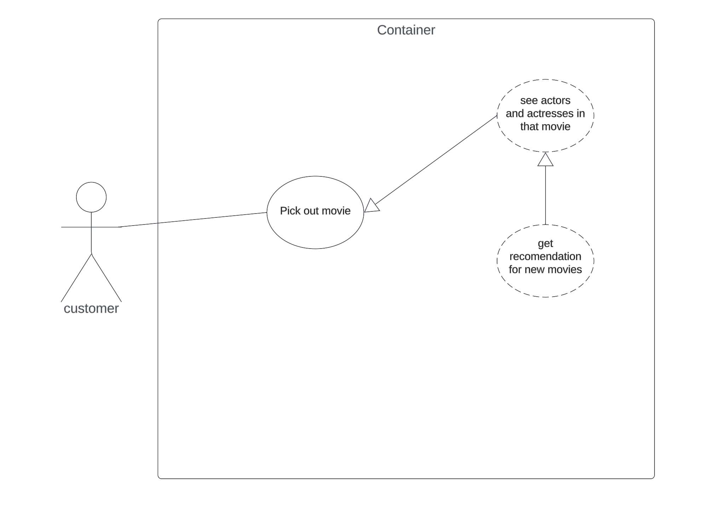
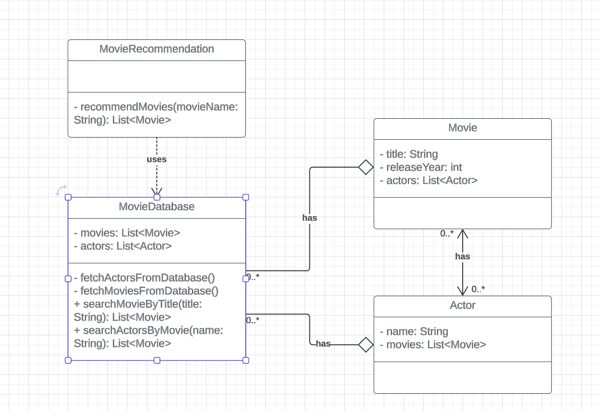
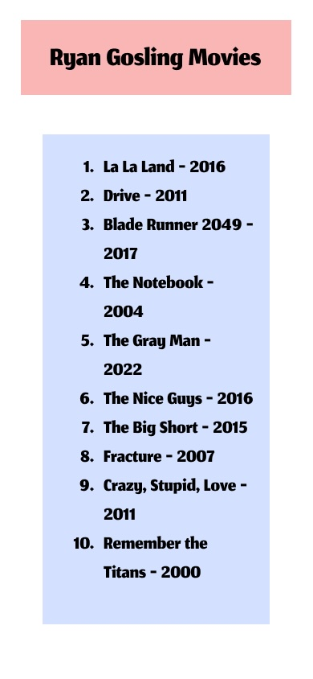

# MovieReview
CIS350 Group Project
This app will allow users to get movie recommendations based on different actors and actresses that they like. The user can check out a movie that they like and get recommendations to new movies based on who is in the movie that they pick. 

1 | Abstract 

Finding a new movie to watch can be a long process and take up all the time you even have to watch a movie in the first place. Our website is aimed to cut down on that issue and give users recommendations to new movies based on their favorite actors and actresses. A user can open the site and pick out a movie, let's say they like Forest Gump, they can know see other movies with the actors in that movie. They can pick out a Tom Hanks movie from a list of movies that he has been in. This will allow a user to choose a new movie much faster and save lots of time on movie nights. You can see all the best movies from our curated list. This allows each user to pick the perfect movie for them each night. You can discover new actors, actresses, and genres of movies to discover what you like the best. Picking a new movie shouldn't be a problem anymore with the help of our Movie Discovery website. 

2 | Introduction 

This app is designed using python and javascript as a web app. We designed this app for desktop to assist users in finding a new movie quicker. The app will show users movie recommendations based on their favorite actors and actresses. Pick a movie you want and see the cast from that movie, now you can pick an actor or actress from that cast and see a list of popular movies that they are in. 

3 | Architectual Design 
<body>
    

        
    

</body>

3.1 | Use Case Diagram 

<body>
    

        
    

</body>

3.2 | Sequence Diagram 

<body>
    

        
    

</body>

3.3 | Class Diagram

<body>
    

        
    

</body>

4 | UI 

<body>
    

         
    

</body>

5 | Functions

read_csv(file_path)
Reads the CSV file containing movie data and returns a list of dictionaries representing movie details.

get_movie_details_by_title(movie_title, data)
Returns details of a movie if found in the dataset.

get_movies_by_shared_actors(movie_title, data)
Returns a list of recommended movies that share any actors with the provided movie.

get_movies_by_genre(movie_title, data)
Returns a list of recommended movies that share at least one genre with the provided movie.

get_movies_by_director(movie_title, data)
Returns a list of recommended movies that share the same director as the provided movie.

6 | Conclusion 

7 | Walkthrough Video 
